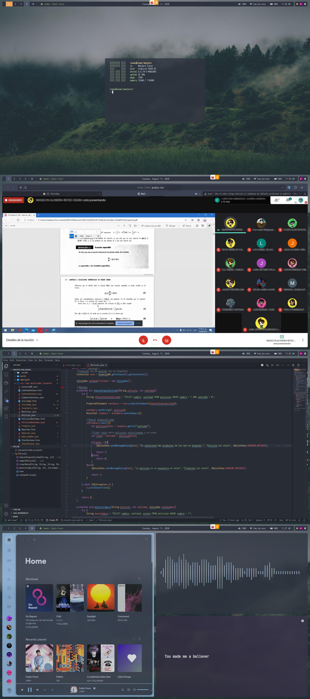

# i3-gaps & Polybar setup

Personal config through my usage of Arch-based linux distros using the following programs and changes.

##### Base programs

- Alacritty
- i3 gaps
- Polybar
- Picom fork
- lxAppearance

### One dark/Nord ***(11/08/2020)***

  

#### Used

- ***GTK Theme:*** Qoqir-dark
  - ***Icons:*** Flattery-dark
- ***Font:*** Iosevka Nerd Font
- ***File Manager:*** Nautilus
- ***ZSH Theme:*** juanghurtado
- ***Cursor:*** Bibata Oil

### Base 16 ***(12/07/2020)***

  

#### Used

- ***GTK Theme:*** Canvas-dark
	- ***Icons:*** Vimix
- ***Font:*** JetBrains mono or SF Pro Display
- ***File Manager:*** Nautilus
- ***ZSH Theme:*** Spaceship
- ***Cursor:*** Bibata Oil
