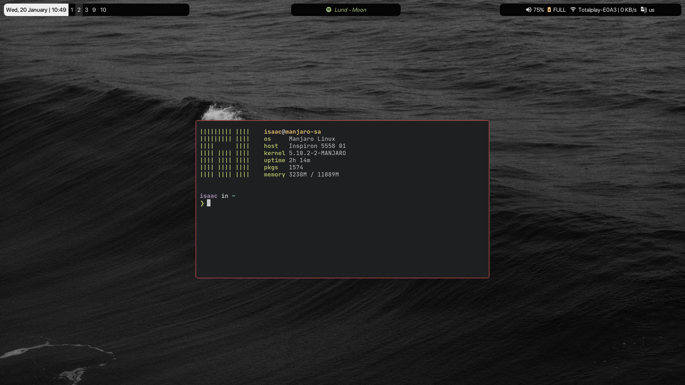

# i3-gaps & Polybar setup

Personal config through my usage of Arch-based linux distros using the following programs and changes.

##### Base programs

- Alacritty
- i3 gaps
- Polybar
- Picom fork
- lxAppearance

## Minimal Base16 **_(20/01/2021)_**

### Used

- **_GTK Theme:_** Orchis-dark Compact
  - **_Icons:_** Vimix-dark White
- **_Font:_**
  - **_System:_** SF Pro Display _(or Iosevka Nerd Font)_
  - **_Terminal/Code:_** Jetbrains Mono, Iosevka Nerd Font or SFMono Nerd Font
- **_File Manager:_** Nautilus
- **_ZSH Theme:_** Spaceship
- **_Cursor:_** WhiteSur Cursors

## One dark/Nord **_(11/08/2020)_**

### Used

- **_GTK Theme:_** Qoqir-dark
  - **_Icons:_** Flattery-dark
- **_Font:_** Iosevka Nerd Font
- **_File Manager:_** Nautilus
- **_ZSH Theme:_** juanghurtado
- **_Cursor:_** Bibata Oil

## Base 16 **_(12/07/2020)_**

### Used

- **_GTK Theme:_** Canvas-dark
  - **_Icons:_** Vimix
- **_Font:_** JetBrains mono or SF Pro Display
- **_File Manager:_** Nautilus
- **_ZSH Theme:_** Spaceship
- **_Cursor:_** Bibata Oil
